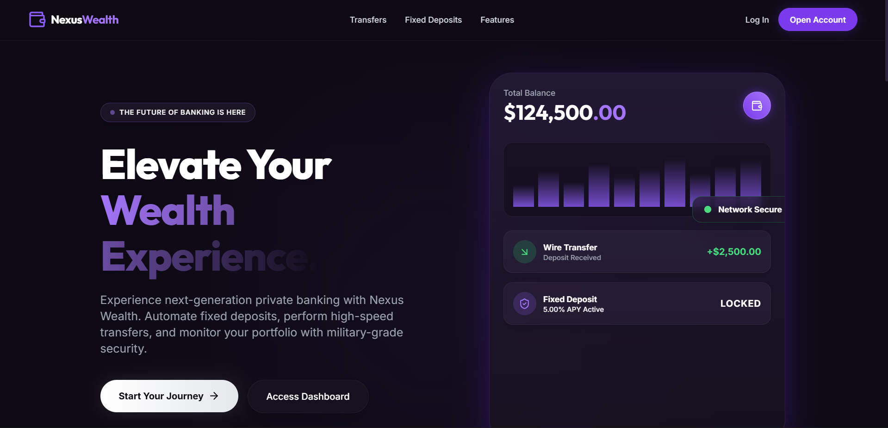
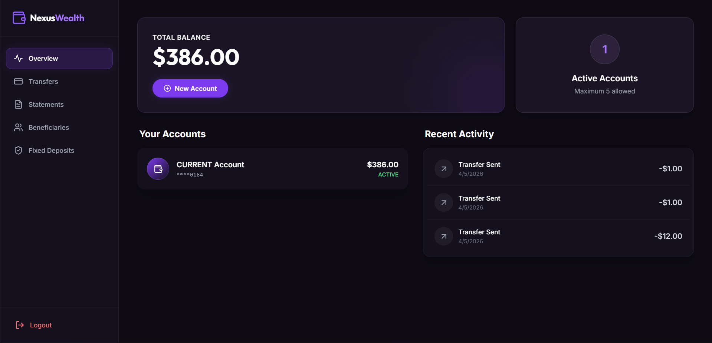

# Nexus Wealth | High-Integrity Core Banking System

**Nexus Wealth** (built on the *BankEngine* ledger engine) is a full-stack, modern neobank system designed with an emphasis on both **transactional correctness** and a **premium, glassmorphic user experience**.

The project features a fully decoupled architecture: a robust Django REST Framework backend handling strict ACID-compliant financial logic, paired with a blazing-fast, heavily animated Vite + React frontend.

---

## 📌 Overview

This project simulates the core infrastructure and frontend interface of a next-generation digital wallet platform. 

It was built in three major phases:
1. **Banking Database & Logic** – A normalized, relational ledger schema with strict database constraints and row-level locking.
2. **Decoupled API Layer** – A Django REST Framework service layer exposing secure endpoints and handling concurrency control.
3. **Premium Frontend Application** – A React 18 SPA featuring glassmorphism, fluid animations (via Tailwind CSS), and asynchronous state management.

---

## 🚀 Key Features

### 💻 Frontend Excellence (Nexus Wealth UI)
* **Dynamic Animations:** Scroll-triggered animations, interactive hover states, and staggered layout entries give the app a premium, high-tech fintech feel.
* **Component-Driven Dashboard:** A comprehensive dashboard featuring account overview side-drawers, animated transaction success screens, and interactive beneficiary quick-picks.
* **Responsive Glassmorphism:** Custom Tailwind configuration utilizing deep royal purples and frosted glass floating panels optimized for both desktop and mobile views.

### ⚙️ Core Backend Integrity (BankEngine)
* **Transactional Integrity (ACID):** Utilizes Django's `transaction.atomic` blocks to ensure that fund transfers either complete entirely or roll back fully, preventing data corruption or "phantom" money.
* **Concurrency Control:** Utilizes `select_for_update()` to handle row-level locking and prevent "Double Spending" race conditions during high-volume transfers.
* **Account State Machine:** Ledgers follow strict states (`PROVISIONED`, `BLOCKED`, `TERMINATED`), ensuring frozen or invalid accounts cannot be interacted with.

---

## 🛠️ Tech Stack

* **Language:** Python 3.10+, JavaScript (ES6+)
* **Backend:** Django 4.x, Django REST Framework, django-cors-headers
* **Frontend:** React 18, Vite, Tailwind CSS, Lucide React (Icons), React Router
* **Database:** MySQL / SQLite

---

## 📸 Screenshots

#### Landing Page


#### User Dashboard Overview


#### Database Architecture


---

## 🚦 Getting Started

To run the full stack locally, you will need to start both the backend server and the frontend development server.

### 1. Backend Setup (Django)

Open a terminal in the root directory:

```bash
# Navigate to the backend directory (or root, depending on where manage.py is located)
cd backend  # If applicable

# Setup Virtual Environment
python -m venv venv
source venv/bin/activate  # On Windows run: venv\Scripts\activate

# Install Dependencies
pip install -r requirements.txt

# Run Migrations
python manage.py makemigrations
python manage.py migrate

# Start the Backend Server (Runs on http://127.0.0.1:8000)
python manage.py runserver
```

### 2. Frontend Setup (React/Vite)

Open a **second** terminal instance in the root directory:

```bash
# Navigate to the frontend directory
cd frontend

# Install Node dependencies
npm install

# Start the Frontend Development Server (Runs on http://localhost:5173)
npm run dev
```

The application is now fully running. Navigate to `http://localhost:5173` in your browser to interact with Nexus Wealth.